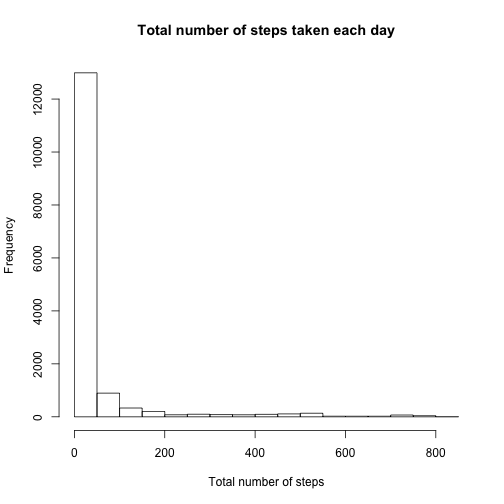

# Reproducible Research: Peer Assessment 1
 By Jawad Rashid


## Loading and preprocessing the data
### 1. Loading the data.

```r
data <- read.csv("activity.csv", stringsAsFactors = FALSE)
```


### 2. Converting the date to a valid R date object.

```r
data$date <- as.Date(data$date)
```


## What is mean total number of steps taken per day?
### 1. Histogram of the total number of steps taken each day

```r
hist(data$steps, xlab = "Total number of steps", main = "Total number of steps taken each day")
```

 


### 2. Mean and median total number of steps taken per day

```r
mean(data$steps, na.rm = TRUE)
```

```
## [1] 37.38
```

```r
median(data$steps, na.rm = TRUE)
```

```
## [1] 0
```


## What is the average daily activity pattern?
### 1. Time series plot (i.e. type = "l") of the 5-minute interval (x-axis) and the average number of steps taken, averaged across all days (y-axis)

```r
averageStepsByInterval <- tapply(data$steps, data$interval, mean, na.rm = TRUE)
plot(names(averageStepsByInterval), averageStepsByInterval, type = "l", xlab = "5-minute Interval", 
    ylab = "Average number of steps taken", main = "Avg number of steps across 5-minute interval")
```

 


### 2. 5-minute interval, on average across all the days in the dataset, contains the maximum number of steps?

```r
# Find the index and the maximum value
maxValues <- which.max(averageStepsByInterval)[1]
maxInterval <- names(which.max(averageStepsByInterval))
maxValue <- which.max(averageStepsByInterval)[[1]]
# Convert the interval from string to integer value
maxInterval <- strtoi(maxInterval, 10L)

maxInterval
```

```
## [1] 835
```

```r
maxValue
```

```
## [1] 104
```


## Imputing missing values
### 1. Total number of missing values in the dataset (i.e. the total number of rows with NAs)

```r
# Missing Values
missingValues <- is.na(data$steps)
table(missingValues)[[2]]
```

```
## [1] 2304
```


### 2. Strategy for filling in all of the missing values in the dataset is use the mean for the 5-minute interval. 

```r
meanStepsByInterval <- tapply(data$steps, data$interval, mean, na.rm = TRUE)
naRows <- data[is.na(data), ]
for (i in 1:nrow(naRows)) {
    naRows[i, 1] <- meanStepsByInterval[[toString(naRows[i, 3])]]
}
```


### 3. Creating a new dataset that is equal to the original dataset but with the missing data filled in.

```r
filledInData <- data
filledInData[is.na(data), 1] <- naRows[, 1]
```


### 4. Creating a histogram with the missing values and recomputing mean and median.

```r
hist(filledInData$steps, xlab = "Total number of steps", main = "Total number of steps taken each day")
```

 

```r
mean(filledInData$steps, na.rm = TRUE)
```

```
## [1] 37.38
```

```r
median(filledInData$steps, na.rm = TRUE)
```

```
## [1] 0
```

```r
averageStepsByIntervalForFilledData <- tapply(filledInData$steps, filledInData$interval, 
    mean, na.rm = TRUE)
```


### Impact of replacing missing values. 

- Mean and median is the same after replacing missing values the reason is that as the mean value was used therefore the mean of the new dataset remain unchanged and adding missing values did not change the median. To see below you can see that the mean values of the new dataset by interval is calculated in averageStepsByIntervalForFilledData and the mean value for old dataset is already stored in averageStepsByInterval so let's compare the two for the first 10 intervals and we will see that both values are same.


```r
averageStepsByIntervalForFilledData <- tapply(filledInData$steps, filledInData$interval, 
    mean, na.rm = TRUE)
averageStepsByInterval[1:10]
```

```
##       0       5      10      15      20      25      30      35      40 
## 1.71698 0.33962 0.13208 0.15094 0.07547 2.09434 0.52830 0.86792 0.00000 
##      45 
## 1.47170
```

```r
averageStepsByIntervalForFilledData[1:10]
```

```
##       0       5      10      15      20      25      30      35      40 
## 1.71698 0.33962 0.13208 0.15094 0.07547 2.09434 0.52830 0.86792 0.00000 
##      45 
## 1.47170
```


- The only change is in the histogram. Compare the two histogram and you will see that the frequency has changed for each interval for total number of steps taken each day. As you can the first bar is higher for filled in values then in missing values because the values for each interval has increased due to filling in.

```r
par(mfrow = c(1, 2))
hist(data$steps, xlab = "Total number of steps", main = "Missing Values")
hist(filledInData$steps, xlab = "Total number of steps", main = "Filled in Missing Values")
```

 


You can see the difference more visible with log of the frequency

```r
par(mfrow = c(1, 2))
hist(log10(data$steps + 1), xlab = "Total number of steps", main = "Log of Missing Values")
hist(log10(filledInData$steps + 1), xlab = "Total number of steps", main = "Log of Filled in Values")
```

 


## Are there differences in activity patterns between weekdays and weekends?

```r
days <- weekdays(filledInData$date)
weekend <- (days == "Saturday" | days == "Sunday")
dayfactor <- factor(weekend, labels = list("weekday", "weekend"))
filledInData$daytype <- dayfactor

groupedData <- aggregate(filledInData$steps, list(DayType = filledInData$daytype, 
    Interval = filledInData$interval), mean)
library(lattice)
xyplot(groupedData$x ~ groupedData$Interval | groupedData$DayType, layout = c(1, 
    2), xlab = "Interval", ylab = "Number of Steps", type = "l")
```

 

```r

```

